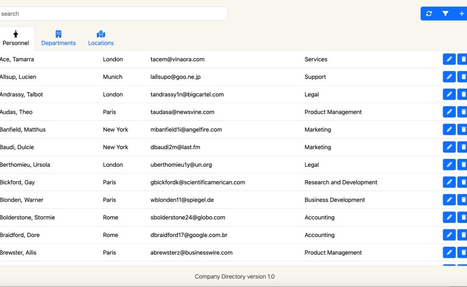
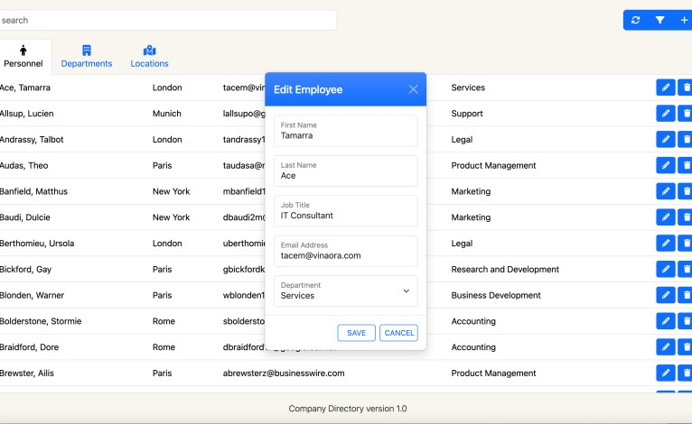
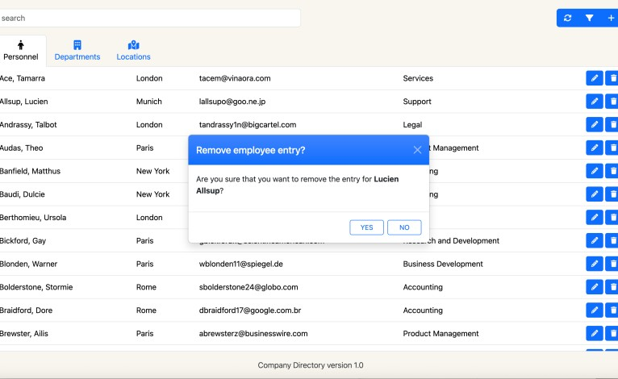

# Project 2: Company Directory

This is an application that allows users to manage personnel, departments, and locations. Users can read, add, edit, and delete records through a user-friendly interface. Search and filter functionalities are also available.

Skills: PHP · AJAX · jQuery · Bootstrap (Framework) · HTML5 · Cascading Style Sheets (CSS) · JavaScript · MySQL

